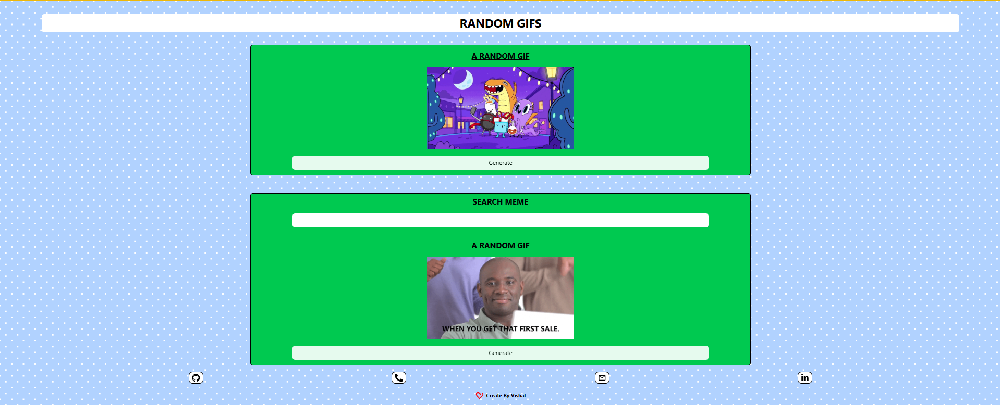

# Random GIF Generator



## 🔗 Deployed Project:
https://random-gif-generator-0hlh.onrender.com

## Overview

Random GIF Generator is a fun and interactive React application that brings you a continuous stream of entertainment. It allows users to generate completely random GIFs or search for specific ones using custom tags. The project uses the Giphy API to fetch the images and is styled with Tailwind CSS for a clean, modern look. 

## Key Features

- **Random GIF Generation:** Instantly fetch and display a completely random GIF with a single click.
- **Tag-based Search:** Enter a keyword (like "cats", "coding", "funny") to generate a random GIF related to that specific tag.
- **Custom React Hook:** Utilizes a custom `useGif` hook to cleanly manage API requests, loading states, and GIF data across components.
- **Responsive Design:** A clean, centered UI built with Tailwind CSS.
- **Loading State:** Includes a spinner component to provide visual feedback while GIFs are being fetched.
- **Social Links:** Includes creator's social links in the footer.

## Technologies Used

- **React:** UI Library (Bootstrapped with Vite)
- **Tailwind CSS:** For rapid and responsive styling.
- **Axios:** For making HTTP requests to the API.
- **Giphy API:** The source of the GIF data.
- **React Icons:** For social and contact icons.

## Getting Started

Follow these instructions to get a copy of the project up and running on your local machine.

### Prerequisites

- Node.js installed on your local machine.
- A Giphy API Key. You can get one by creating an app on the [Giphy Developers Portal](https://developers.giphy.com/).

### Installation

1. **Clone the repository:**
   ```bash
   git clone <your-repository-url>
   ```

2. **Navigate to the project directory:**
   ```bash
   cd Random-GIF-Generator
   ```

3. **Install dependencies:**
   ```bash
   npm install
   ```

4. **Set up Environment Variables:**
   Create a `.env` file in the root of the project and add your Giphy API key:
   ```env
   VITE_GIPHY_API_KEY=your_giphy_api_key_here
   ```

5. **Start the development server:**
   ```bash
   npm run dev
   ```

6. **Open your browser:**
   Navigate to the URL provided by Vite (usually `http://localhost:5173`).

## Folder Structure

```
Random-GIF-Generator/
├── hook/
│   └── useGif.jsx        # Custom hook for Giphy API calls
├── public/
├── src/
│   ├── components/
│   │   ├── Random.jsx    # Component for purely random GIFs
│   │   ├── Spinner.jsx   # Loading spinner UI
│   │   └── Tag.jsx       # Component for tag-based GIFs
│   ├── App.jsx           # Main application component
│   ├── index.css         # Tailwind directives and global styles
│   └── main.jsx          # Entry point
├── .env                  # Environment variables (not tracked by git)
├── package.json
└── vite.config.js
```

## Author

**Vishal Sarvade**
- [GitHub](https://github.com/its-vishal0887)
- [LinkedIn](https://www.linkedin.com/in/vishal-sarvade-47764031b/)
